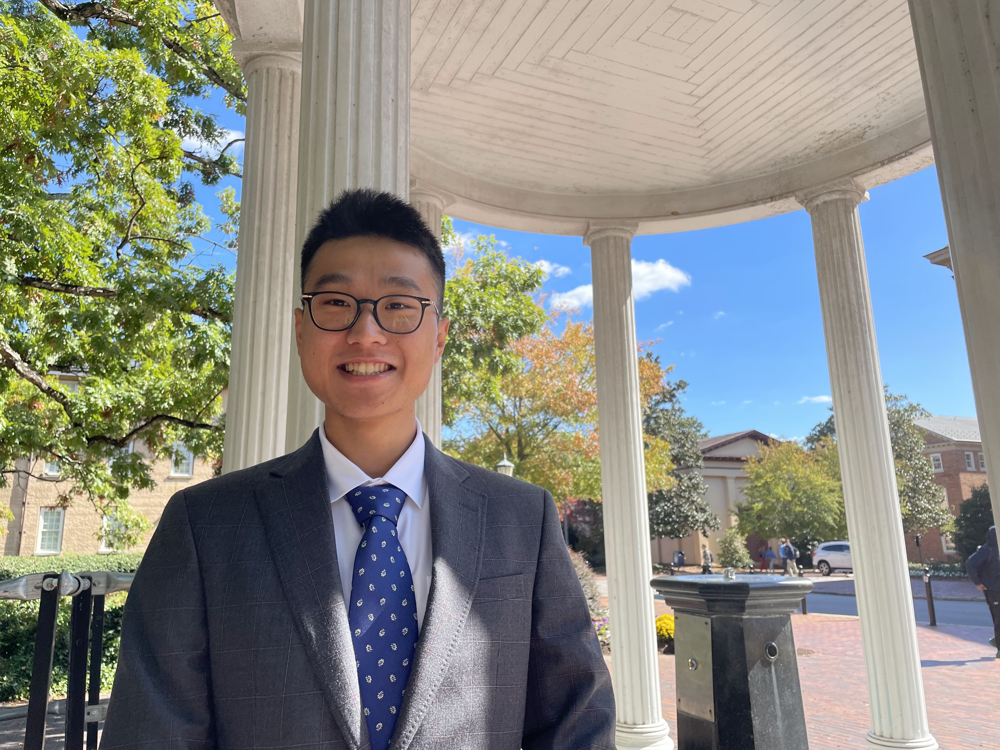

---
---

# Nice to Meet You!

<!---->

My name is Tianyi Liu. I am currently a fifth year Ph.D. student in the [Department of Biostatistics](https://sph.unc.edu/bios/biostatistics/) at The University of North Carolina Gillings School of Global Public Health. I grew up in Beijing, China and began my study in the United States at UNC, where I obtained both an M.S. and a B.S.P.H in Biostatistics, as well as a B.A. in Mathematics. I considered studying History and Pure Mathematics, but ultimately chose to pursue Biostatistics as a quantitative subject that can bear impacts on the health of living humans. I see myself as a follower of [Epicurean philosophies](https://plato.stanford.edu/entries/epicurus/) (for the most part).

While I am particularly enthusiastic about statistical research and consulting, topics of which you can find below, I am also deeply interested in traveling, sampling good foods, working and reading at coffee shops, and trivia. I have recently started playing poker and aspire to become a decent player. My favorite sport is soccer and my favorite soccer team is [Bayern Munich](https://en.wikipedia.org/wiki/FC_Bayern_Munich).

  



## Highlights



My independent research spans questions regarding cell-type deconvolution, relying heavily on theories and algorithms of matrix factorization. I also dab in collaboration in precision medicine, work with a group of scientists on quantifying genetic impacts of inorganic arsenics on type-II diabetes using mouse models, and consult on statistical analysis for neonatal physical therapeutic interventions.









My Highlighted projects include a collaboration with UNC Women's Soccer, an R package for cell-type deconvolution named ARTdeConv.









You can also follow some of my close colleagues and friends. See what they are up to these days!









## About The Title

*The title Larry in a Lab Coat is a sarcasm. It comes from the impression of biostatisticians from a person oblivious to the concept - they work in a wet lab just like biologists. Larry is my pseudonym for coffee orders.*
